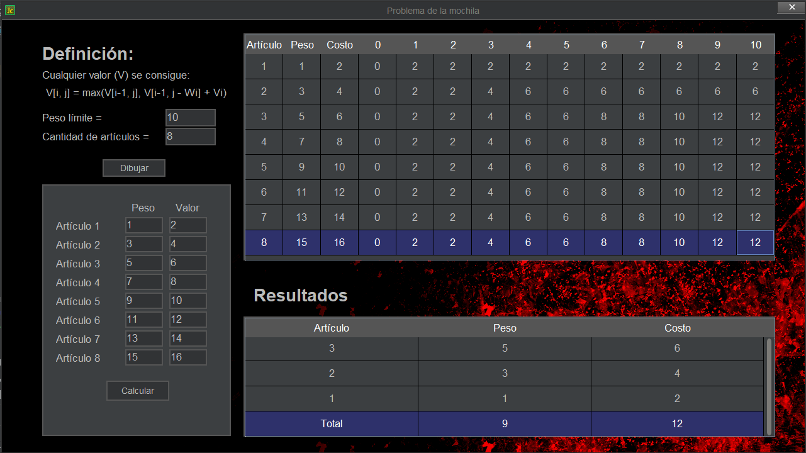

# problema-de-la-mochila
También conocido como "Knapsack problem", es un problema de maximización u optimización con combinatoria, donde interviene la programación dinámica. En este caso se maximiza para los casos enteros, es decir no se permite tomar fracciones de los elementos.

